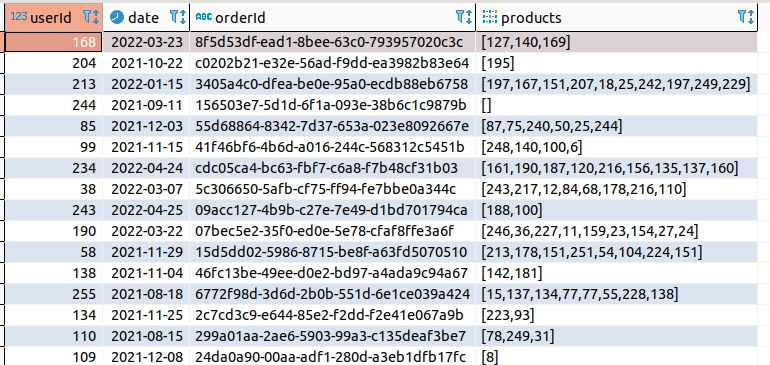
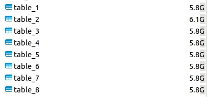
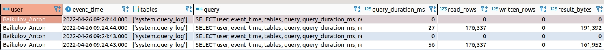
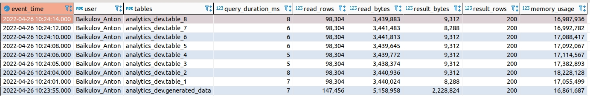
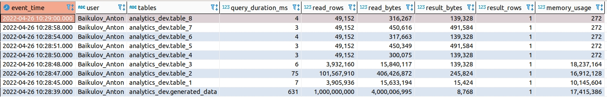
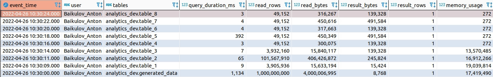

tags:
[clickhouse](https://github.com/search?q=user%3Abaikulov+repo%3Abaikulov%2Finstructions+tags%3A+clickhouse+in%3Afile&type=code),
# Тестируем оптимизацию запросов в Clickhouse

Сразу оговорюсь, я в работе с CH новичок и вообще только вчер с пальмы слез. Поэтому я не я, корова не моя.

### Исходные данные
Нам потребуется доступ к базе CH, немного сгенерированных данных и куча времени. 
Для начала сгенерируем исходные данные.

```sql
WITH cte as (
	SELECT *
	FROM generateRandom('userId UInt32, for_dates UInt8, orderId UUID, products Array(UInt8)', 1)
	LIMIT 1000000000
)
SELECT userId, date_sub(day, for_dates, toDate(NOW())) as  date, orderId, products
FROM cte
```
Мы получим вот такую таблицу на 1 млрд. строк.


Сохраним её в базу, чтобы сгенерированные данные были одинаковыми дял всех последующих действий.

```sql
CREATE TABLE analytics_dev.generated_data ENGINE = MergeTree() Order BY tuple() as
WITH cte as (
	SELECT *
	FROM generateRandom('userId UInt32, for_dates UInt8, orderId UUID, products Array(UInt8)', 1)
	LIMIT 1000000000
)
SELECT
    userId,
    date_sub(day, for_dates, toDate(NOW())) as  date, # генерируем даты на основе чисел
    orderId,
    products
FROM cte
```

Проверим её содержимое
```sql
SELECT
    count(*) as rows,
    count(distinct date) as dates,
    count(distinct userId) as users,
    count(distinct orderId) as orders
FROM analytics_dev.generated_data
```
У нас получится 3 млрд.строк, 65 536 уникальных дат и 256 уникальных пользователей.


### Подготовка тестов
Теперь мы будем создавать дочерние на базе исходной и проверять насколько быстро они позволяют считать данные

Мы будем использовать всего две опции для эксперимента:
- Order_By
- Partition_By

1. Таблица с партицированием по дате
```sql
CREATE TABLE analytics_dev.table_1 ENGINE = MergeTree() PARTITION BY date ORDER BY tuple() as
SELECT *
FROM analytics_dev.generated_data
```
2. Таблица с партицированием по месяцу
```sql
CREATE TABLE analytics_dev.table_2 ENGINE = MergeTree() PARTITION BY toYYYYMM(date) ORDER BY tuple() as
SELECT *
FROM analytics_dev.generated_data
```
3. Таблица с сортировкой по дате
```sql
CREATE TABLE analytics_dev.table_3 ENGINE = MergeTree() ORDER BY date as
SELECT *
FROM analytics_dev.generated_data
```
4. Таблица с сортировкой по дате и userId
```sql
CREATE TABLE analytics_dev.table_4 ENGINE = MergeTree() ORDER BY (date, userId) as
SELECT *
FROM analytics_dev.generated_data
```
5. Таблица с сортировкой по дате, userId, orderId
```sql
CREATE TABLE analytics_dev.table_5 ENGINE = MergeTree() ORDER BY (date, userId, orderId) as
SELECT *
FROM analytics_dev.generated_data
```
6. Таблица с сортировкой по дате, userId, orderId и партицией по дате
```sql
CREATE TABLE analytics_dev.table_6 ENGINE = MergeTree() Partition By date ORDER BY (date, userId, orderId) as
SELECT *
FROM analytics_dev.generated_data
```

7. Таблица с сортировкой по дате, userId, orderId и партицией по месяцу
```sql
CREATE TABLE analytics_dev.table_7 ENGINE = MergeTree() Partition By toYYYYMM(date) ORDER BY (date, userId, orderId) as
SELECT *
FROM analytics_dev.generated_data
```

8. Таблица с сортировкой по дате, userId и партицией по месяцу
```sql
CREATE TABLE analytics_dev.table_8 ENGINE = MergeTree() Partition By toYYYYMM(date) ORDER BY (date, userId) as
SELECT *
FROM analytics_dev.generated_data
```

После создания таблиц сразу можем увидеть разницу. Кол-во строк в каждой - 222,668,308*


*P.s. из-за лимита на кол-во партиций был вынужден всем таблицам дать одинаковый фильтр 
**WHERE date >= '2022-03-01'**

### Просмотр результатов

Для начала напишем запрос, с помощью которого будем смотреть результаты обращения к нашим тесовым таблицам

```sql
SELECT
    user,
    event_time,
    tables,
    query,
    query_duration_ms,
    read_rows,
    written_rows,
    result_bytes,
    read_bytes,
    written_bytes,
    result_rows,
    memory_usage,
    type
FROM system.query_log
ORDER BY event_time Desc
```

Этот запрос вернёт нам содержимое из системной таблицы, где мы сможем посмотреть основные метрики запроса


### Тестирование

К каждой таблице зададим одинаковые запросы. У вас могут быть любые другие значения

Сперва просто данные за один день - '2022-04-01'
Затем с добавлением конкретного userId = '3801011384'
И в конце с конкретным orderId - 'dc03649b-46f9-dcbf-72a1-ad5ddc264cd6'

```sql
SELECT *
FROM ...
WHERE date = '2022-04-01'
```


```sql
SELECT *
FROM ...
WHERE date = '2022-04-01'
AND userId = '3801011384'
```


```sql
SELECT *
FROM ...
WHERE date = '2022-04-01'
AND userId = '3801011384'
AND orderId = 'dc03649b-46f9-dcbf-72a1-ad5ddc264cd6'
```


### Результат
Выводы делайте сами!